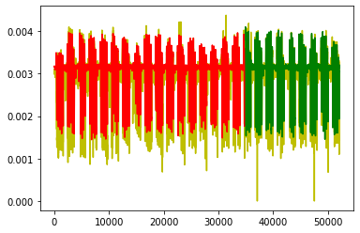

# CSCI 152 Neural Networks Final Project
## Graph Neural Network Traffic Flow Forecasting in New York City
### Members
Austin Zang, Devin Guinney, Ethan Lee, Saatvik Kher, Sam Malik
### Introduction

Traffic congestion across the United States is a problem often discussed both academically and casually. On a more macro scale, it's a cause for economic inefficiency, pollution, and the deterioration of human health. On a micro scale, almost everyone experiences a "bad day" in transit.

Recent developments in machine learning and data science has led to the rise of traffic forecasting: the ability to use historical traffic data to predict traffic information such as volume, speed, and flow of vehicles at a given future time. Applications of neural networks in this domain are essential to improve travel safety and foster cost-efficient travel according to <a href="https://www.tandfonline.com/doi/full/10.1080/23311916.2021.2010510">Kashyap et al., 2021</a>. Government officials may then use these predictions to plan more efficient road infrastructure, making decisions on the budget, scope, and geometry of America's transportation network. 

The Bay Area, in Northern California, houses a few of the largest and most renown cities in the United States. The area is a leading hub for many of the world’s leading technology companies, including Google, Apple, and Meta. Given its national significance and substantial population, traffic congestion in the Bay Area is crucial to understand and analyze to hopefully develop insights into methods to improve vehicular congestion for productivity, economy, and quality of life boosts for residents and regular commuters.
More uniquely, the traffic in the Bay Area is unique in several regards. With a population of over 7 million people, the Bay Area is quite densely populated, which can lead to various traffic congestion issues. In terms of the Bay Area’s topography, the area contains steep hills, valleys, which can heighten transportation maintenance issues. Additionally, the area’s freeways and highways feature complex interchanges which can lead to bottlenecks and increase the risk of road accidents. Lastly, despite BART, their public transport system, the majority of residents in the area rely on private vehicles to commute from location to location, which can contribute to traffic congestion, and justifies the need for better traffic forecasting techniques because commuters need to know this vital information.

To improve upon current methods for traffic prediction, we employ the use of Recurrent Graph Neural Networks to model the spatio-temporal dynamics of the Bay Area traffic network. Graph Neural Networks (GNNs) are a rapidly advancing area of ML research, featuring an architecture designed to analyze the complex topology of interconnected graphs. The current literature on this topic relies heavily on using Convolutional Neural Networks and Recurrent Neural Networks to forecast traffic flow. However, according to a work by <a href="https://arxiv.org/pdf/2101.11174.pdf">Wang, Xiaoyang, et al., 2022</a>, a new type of neural network, the Graph Neural Network, has become increasingly popular in modeling traffic flow's spatial and temporal dependencies. With GNNs, it's possible to do node-level, edge-level, and graph-level inference - a nearly direct translation of the real-world traffic prediction problem.  

Considering all of these factors, we hope to develop a project that applies GNN methodologies to traffic forecasting in the Bay area. Ideally, our model will be able to identify bottlenecks, and inefficiencies within the city that could be remedied with either greater road development. Short of actual policy recommendation, we could also use this information to help Bay Area drivers identify patterns and improve their quality of travel within the city. We will also compare our GNN performance and application to existing approaches (including conventional CNN) in literature.

### Related Works
We can draw inspiration from several sources here: this area of research is novel but good headway has been made by many researchers. <a href="https://arxiv.org/abs/1810.00826">Xu et al., 2019</a>, present a general overview of GNNs and their unique power when applied to representation learning on graphs: they also present a framework for evaluating the expressive power of different GNN architectures, an important problem to consider when designing our own. A 2020 meta-analysis by <a href="https://link.springer.com/article/10.1007/s42421-020-00030-z">Varghese et al., 2020</a>, establishes a good baseline for our work, as they compare the accuracy, datasets, and methodology of many different neural network approaches to traffic forecasting. In addition, they also identify sub-problems within the larger traffic forecasting space that seem particularly difficult, and analyze the impact and state of each of these fields. We may base our performance evaluation against the 136 other studies analyzed by this paper.
There is also much possibility to go beyond just a basic GNN when building our model. Take, for example, <a href="https://arxiv.org/pdf/1905.12256.pdf">Lee  et al., 2022</a>, who proposed a novel <b>DDP-GCN</b> (Distance, Direction, and Position Graph Convolutional Network) model capable of capturing more non-euclidean traffic flow characteristics. A multigraph data representation is at the heart of this approach: allowing more than one edge per vertex pair captures complex spatial relationships. We will likely attempt a similar approach when constructing our own data representation.
<a href="https://dl.acm.org/doi/pdf/10.1145/3366423.3380186">Wang et al., 2020</a>, introduce a spatial temporal graph neural network for traffic flow prediction that specializes in time-varying features of the graph. The proposed model claims to comprehensively capture spatial and temporal patterns and offers a mechanism to aggregate information from adjacent roads. The framework proposes a GNN layer for adjacent roads and a recurrent network combined with a transformer layer for local and global temporal trends. The researchers then validate the feasibility and advantages of the proposed framework on real traffic datasets. While the framework seems technically complex to implement, it might help inspire ideas for how to deal with spatial and temporal dependencies in our problem.
Another consideration is vehicle-vehicle interaction - after all, traffic is in large part determined by the reactive behavior of human drivers. <a href="https://ieeexplore.ieee.org/stamp/stamp.jsp?tp=&arnumber=8814066&isnumber=8813768">Diehl et al., 2019</a>, developed an approach that successfully interprets a traffic scene as a complex graph of interacting vehicles. Using GNNs, they make traffic predictions using interactions between traffic participants while being computationally efficient and providing large model capacity. They showed that prediction error in scenarios with much interaction decreases by 30 % compared to a model that does not take interactions into account. This suggests that interaction is important, and shows that we can model it using graphs.
Additionally, the paper <a href="https://www.researchgate.net/publication/330473040"> Graph Attention LSTM Network: A New Model for Traffic Flow Forecasting", Wu, Tianlong, et al., 2018 </a>, takes advantage of the self attention mechanism, most popular for its use in Transformers, by combining a graph neural network with attention and long short term memory networks to accurately predict the temporal depencies of traffic. They predicted traffic data for the next 5 minutes using the previous 30 minutes of data; our group will adopt a similar regime for prediction. 
Taking into account all the work that has already been done, we hope to devise an approach that can dynamically mix the best parts of previous research and acheive comprable, if not better, GNN performance. 

### Methods
We will employ the use of a recurrent graph neural network model, a Gated Recurrent Unit Graph Attention Network, and a stacked Long Short Term Memory network to use 1 hour of previous traffic data to predict the next 15 minutes. The dataset we intend to use is the PEMS-BAY traffic dataset [link here]. This is a traffic dataset collected by CalTrans Performance Measurement System (PeMS). This project uses a pre-cleaned version of this dataset (Pytorch geometric provided dataset) that preselected 325 sensors in the Bay Areas with 6 months of data ranging from January 1st 2017 to May 31th 2017. The distribution of these sensors is below. The readings of these sensors are aggregated into 5 minute slots.

We use Pytorch and Pytorch geometric to build the frameworks of these graph neural network and LSTM models. We intend to access this data using its provided API, involving common Python libraries such as Pandas, Requests, and NumPy. Using this data, we will construct a network graph for each unique 5 minute interval and conduct time series analysis on the data using the various we mentioned above.

Useful predictors to predict traffic include: previous traffic flow, the time of day, the time of year, or weather. For this project, we will only include historical traffic flow data and the time of day data to predict the traffic flow data for future timesteps. Because our model is highly localized to 1 and a half hour windows, the time of year will not impact the prediction so much, and weather data is a stretch goal for us to achieve later.

The cleaned data looks like the graph below. There appears a clear time-series pattern that could be modelled using a time series forecasting method such as ARIMA or ETS. Instead, we will use deep learning frameworks and compare the performance of GNNs, CNNs and RNNs on this data. 

### Goals
1. Predict traffic flow in San Francisco
2. Deploy to a web-based frontend 
3. Successfully learn and apply a specialized GNN to traffic flow problems
4. Compare GNN performance to traditional CNN, RNN performance in literature 

### Ethical Sweep
We will closely monitor this project to ensure our network does not unfairly affect specific areas or groups. Though we are limiting our project only to consider traffic within the United States, to keep consistency amongst laws and customs, the type of driving, vehicles, and demographics will change from state to state, county to county, and even town to town. One such factor that we will consider is driving habits. The attitude of safe driving and speed limits will be subject to the territory. Similarly, weather conditions and the general geographical landscape will change drastically nationwide. A model trained in a bustling metropolitan will not necessarily be able to account for a snowstorm in a sparse rural area. 
Given that we would not want to prejudice the model for a particular environment unfairly, we will attempt to account for this by adjusting accordingly. Additionally, the speed of vehicles will vary, as well as maneuverability and ability to change lanes. Finally, we will need to consider the car and conditions in which the model will be trained. The vehicle, driver, road conditions, weather, time of year, state driving laws, the density of police surveillance, and even the number of occupants will affect the data passed to the model. 

## What is a Graph Neural Network
A _Graph_ in a most basic sense is described a set of nodes, also known as vertices, $V$, and a set of edges, $E$, that connect those vertices to one another. Data with objects and relationships between those objects can be modeled as a graph. Recent developments in various neural network architectures have lead to the rising prominence of _Graph Neural Networks_: neural networks that are well suited to model graphically structured data. Learning intricate relationships in graphically structured data falls into "geometric deep learning."

There are three different types of "prediction tasks" that a graph neural network can perform: node level, edge level, and graph level predictions. This project deals only with node level predictions, that is, predicting some quality about the nodes in a graph. 

In order to perform these node level predictions, each node initially begins with an embedding that describes its initial state. Similar to convolutions in a Convolutonal Neural Network, the fundamental operation of a graph neural network is "Message Passing" which updates node embeddings by aggregating neighboring nodes' vector. This way, a deeper model, one with more "Message Passing" layers, will enforce information sharing between relevant nodes in the graph and allow for richer updated node embeddings to then pass through a Feed Forward for any downstream task (i.e. pass a node's final vector through a linear layer for either classification or regression).

### Graph Neural Networks to Describe Traffic Data
Applying traffic data to graphs, we can interpret traffic sensors around a given location as "nodes" and the streets connecting them the "edges" of a graph. At a given time, each "node", or traffic sensor, is assigned a vector $[x_1, x_2] \in \mathbb{R}^2$ where $x_1$ is the average speed of cars driving over that traffic sensor in a given 5 minute period and $x_2$ is a numeric representation of the time of day, between 0 and 1. Two nodes, or traffic sensors, are connected by an weighted edge if they are neighboring traffic sensors. The weight of an edge connecting two traffic sensors is determined by the Gaussian RBF Kernel distance between them. 

The problem here, however, is that traffic introduces a time dimension. At different times throughout the day, the traffic at any given road will change: even though the structure of the graph representing the physical road network does not change, the node vectors describing the speed and traffic flow over a given sensor does. Hence, for every 5 minute interval, there will be a graph representing the current state of traffic for all sensors. We therefore define $[x_{1,t}, x_{2,t}] \in \mathbb{R}^2$ to be each node's vector where $x_{1,t}$ is the average speed of cars driving over that traffic sensor at tilmestep $t$ and $x_{2,t}$ is the time of day corresponding to $t$.

[insert picture]

To be more explicit on the time of day, there are 288 five-minute intervals in a day. The time of day measure ranges from 0 to 1, and increments by \frac{1}{288} to denote the specific time of day for a given traffic speed measurement. A value of 0 would correspond to 12am, and a value of 0.16319 the 47th (0.16319 \times 288) five-minute interval in a day, which is around 3:55am.

### Spatio-Temporal Graph Neural Networks
Standard graph neural network's model spatial data very well, but this assumes that this data is static. To model spatial and temporal data like traffic, we need to add a recurrent layer on top of a graph neural network. This is the idea of a patio-temporal graph neural network: a neural network model that evolves a graph, or graphically structured data, through time. Therefore, in order to model traffic data, we first need to model the data graphically at each timestep, then use a recurrent graph neural network to use previous traffic data to previous future traffic speed and flow for future time steps. 

### The formal traffic flow prediction problem
The problem statement is as follows. Given traffic data for $t$ previous time steps, can we predict the traffic data for $T$ future time steps? For instance, if data is collected every 5 minutes, can we use 60 minutes of previous data ($t=12$ time steps) to predict traffic data for the next 30 minutes ($t=6$ time steps). In order to achieve this, we first model traffic data using a graph (nodes are traffic sensors each with node vectors of traffic speed and volume) for each time step; this will be 12 graphs. We then pass these 12 graphs into a recurrent graph neural network to then output 6 graphs that should be accurate predictions of the state of traffic 6 time steps in the future. 

In our case, we will be using the PEMS-BAY traffic dataset. The PEMS-BAY traffic dataset is a publicly available traffic dataset collected by the California Department of Transportation (Caltrans) Performance Measurement System (PeMS) on the San Francisco Bay Area freeway network. The dataset provides traffic data, including traffic flow, speed, and occupancy, collected by inductive loop detectors installed on the freeway network. We will cover a period of 6 months, from January 1, 2017, to May 31, 2017, and includes data from 325 loop detectors on the freeway network. The dataset is provided and used in the form of numpy arrays; we also converted them into usable csv files. These numpy arrays are adjacency matrices of nodes, which is constructed by road network distance with a thresholded Gaussian kernel.

### Describe Model Architectures
The models we used take the shape of an encoder-decoder architecture.
[insert picture]
We pass the 12 graphs through a TGCN to obtain the final hidden state for each of the nodes. We then take a node's hidden state and decode it using another GRU into 6 future time steps of traffic data, and do this for each node in the graph. 

[insert picture]
Another architecture we have is to use the same encoder, but just pass the hidden state vector into a linear layer with 6 output layers, each one representing the traffic speed at a given time step. 

## RNN:
Recurrent neural networks (RNNs) are a model architecture well suited to inference on time series and sequential datasets—this unique power is due to their ability to take into account and learn from an entire history of past inputs at any one given step. Recent history has seen the increased popularity of not only basic RNNs, but also the closely related Long Short-Term Memory (LSTM) and Gated Recurrent Units (GRUs) neural networks. 

### RNN - Motivation

We believe RNNs translate well to the traffic prediction problem due to its naturally sequential and additive nature: the most important part of how people are driving right now is how other cars have been behaving in the past 15, 30, and 120 minutes. Furthermore, users will generally desire proximate traffic information, so a short range prediction such as this will be most helpful for 'real world' applications. We want our model to take into account a sliding window of past traffic data, building upon its knowledge of recent history to make an informed guess of the near future. 

In addition, RNN performance serves as a useful baseline for our evaluation of GNN approaches. As a “tried-and-true” mainstream approach to solving sequential problems, we may compare and contrast the accuracy and training complexity of cutting-edge GNN technology against standards set by RNNs, LSTMs, and GRUs. For our purposes, we decided that an LSTM would be the most compelling type of RNN to compare to the GNN we'd developed. 

### RNN - Methodology
Our first priority was to make a functional RNN, then move on the various augmentations and testing of how use of such models may result in differing outputs. Once training is complete, we would directly compare the inference accuracy and training time to that of our GNNs, as well as past results in literature. 

A big struggle was feature engineering and data wrangling: RNNs must take in a time-series sequence of input vectors that contain consistent formatting and information across the entire dataset. Due to large gaps in sensor coverage across time and space in the New York City traffic data, we were forced to abondon our New ork traffic dataset to the more complete San Francisco transit dataset—the vectors converted from NYC were too inconsistent to provide decent input. Once the shift was made, we were able to use PyTorch's existing RNN framework to design a LSTM recurrent neural network that predicted future traffic volume.

### Final Visualization

Of course, we are ultimately dealing with spatial data that describes real physical places in the world. Our hope was that by the end of the project, we would be able to use geotagging and other feature engineering approaches to map the output of our neural networks into a human-readable map of San Francisco. At each street, we would show the predicted speed of traffic, dynamically updating the map as we move through different times of year and day. 
We believe such a visualization would not only prove interesting, but also analytically valuable: some trends in traffic data may not be obvious until put into the context of cartography. The complex relationships between urban design, geography, sociology, and traffic may hopefully reveal themselves to a keen observer. 

### Discussion Outline
We reformatted and feature engineered our own dataset based off of the PEMS Bay Area, which uses data from automated sensors to record the flow of vehicles within city limits. The major focus was mapping the existing data into a GNN-compatible graph structure. We then trained 2 different neural network architectures (including GNN, LSTM, etc.).
One main point of analysis centers around the performance of different neural networks: we compare the final prediction accuracy and training time of each network. Accuracy is an important metric because it determines how useful a given model is: if a neural network is unable to consistently forecast traffic flow, it's not useful in the context of policy planning. Training time is a useful metric to determine model complexity: if a given neural network is highly accurate but requires exorbitant time or computing resources, it's also not very applicable.
Similar work has been done by [Kashyap et. al., 2021](https://doi.org/10.1080/23311916.2021.2010510), and our results differ/align in the following ways:
You can see in this chart and associated line graph of GNN, CNN, and RNN metrics that it supports/refutes the claims above.
Given more time and resources, we would love to do a deeper dive on GNN engineering, adding more features and analyzing the impact on accuracy and training time that these additional features may have. In addition, it would be interesting to further optimize other neural network architectures and generalize these models to problems beyond just the Bay Area. After all, traffic dynamics across different metropolitan areas, regions, and even countries are highly variable.

### Reflection

During the creation and training of the RNN models, our group ran into a myriad of issues. First, we struggled with the New York dataset. We tried to coallate the entries to get only the most reliable traffic sensors but the incosistancy of the data made that effort fruitless. Ulitmatly, we were forced to swtich to the Bay Area PEMS dataset. This proved to be very easy to work with. After standardizing the data into a large csv file of 325 repeating sensors at 5 minute intervals, we were able to manipulate those entires into a large matrix, with the volume of traffic per five minutes at each sensor occupying the columns of our 2D matrix. We ran into trouble dealing with the shape of the input vectors into the tensors, but we were able to squeeze and unsqueeze the vectors until that problem was no longer an issue. Similarly, we found that the LSTM worked more efficiently when the data was normalized, so that was added. Type errors also hounded our progress and we found ourselves pouring over documentation to figure out why our tensors were doubles instead of floats.  Generally, through much trial and error, we were able to find solutions to the frequent and minor problems encountered in the pursiut of a functional RNN. 

In conclusion, during this process of learning, we chose to explore a relatively new neural network model and learn its intricacies to a degree sufficient enough to apply to a complex traffic flow problem. To the extent that the project was about learning and growth, we achieved exactly that. We successfully implemented these models and trained them…the code worked! Although we weren’t able to visualize our outputs, we still managed to train good traffic prediction models. The majority of the work for this project was finding a good dataset and data preprocessing. We bounced around from New York traffic data to Bay Area traffic data until we settled on a dataset already formatted in a suitable format to train a model on. All in all, we are happy with our outcomes: we learned a lot, and had fun while doing it.

### Future Implications

This project showed the potential of using graph neural networks for modeling traffic data as opposed to using other conventional methods such as recurrent neural networks. The implications fo future research have no limit. An exploration into the feasability for these methods to be distilled into a usable application, specifically for use as a way to more efficently navigate roads. The movement of goods and humans is an integral part of existence. With the increase in the population and the necessity of social wellbeing of humans, travel is exponentially growing. As technology is evolving day by day so is the number of vehicles increasing. With this rapid rate of increase in vehicle, management of movement of vehicles is very critical. Vehicular management helps in optimizing the travel time and cost of the travel. For developing a precise vehicular management system, it is essential to have accurate background information. Traffic flow is one of the most important data which is required for developing a precise vehicular management system.

### Works Cited
[1] Diehl, Frederik, et al. “Graph Neural Networks for Modelling Traffic Participant Interaction.” 2019 IEEE Intelligent Vehicles Symposium (IV), 2019, https://doi.org/10.1109/ivs.2019.8814066. 

[2] Jiang, Weiwei, and Jiayun Luo. “Graph Neural Network for Traffic Forecasting: A Survey.” Expert Systems with Applications, vol. 207, 2022, p. 117921., https://doi.org/10.1016/j.eswa.2022.117921. 

[3] Kashyap, Anirudh Ameya, et al. “Traffic Flow Prediction Models – a Review of Deep Learning Techniques.” Cogent Engineering, vol. 9, no. 1, 2021, https://doi.org/10.1080/23311916.2021.2010510.

[4] Lee, Kyungeun, and Wonjong Rhee. “DDP-GCN: Multi-Graph Convolutional Network for Spatiotemporal Traffic Forecasting.” Transportation Research Part C: Emerging Technologies, vol. 134, 2022, p. 103466., https://doi.org/10.1016/j.trc.2021.103466. 

[5] Varghese, Varun, et al. “Deep Learning in Transport Studies: A Meta-Analysis on the Prediction Accuracy.” Journal of Big Data Analytics in Transportation, vol. 2, no. 3, 2020, pp. 199–220., https://doi.org/10.1007/s42421-020-00030-z. 

[6] Wang, Xiaoyang, et al. “Traffic Flow Prediction via Spatial Temporal Graph Neural Network.” Proceedings of The Web Conference 2020, 2020, https://doi.org/10.1145/3366423.3380186. 

[7] Wu, Tianlong, et al. “Graph Attention LSTM Network: A New Model for Traffic Flow Forecasting.” 2018 5th International Conference on Information Science and Control Engineering (ICISCE), 2018, https://doi.org/10.1109/icisce.2018.00058. 

[8] Xu, Keyulu Xu, et al. “How Powerful Are Graph Neural Networks?” 22 Feb. 2019, https://doi.org/https://doi.org/10.48550/arXiv.1810.00826. 

